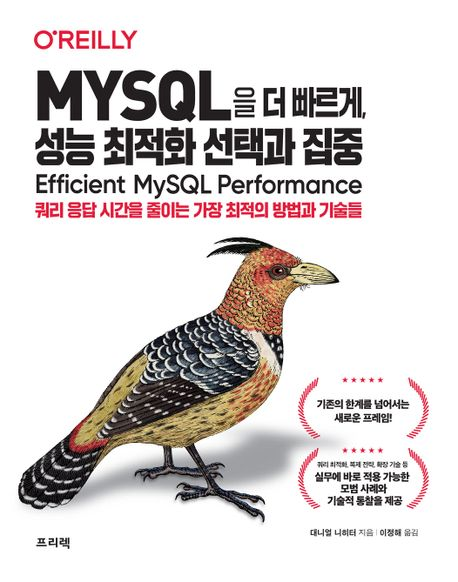

# MYSQL을 더 빠르게, 성능 최적화 선택과 집중
### Content
- [0. 준비하기](./ch.00/ch.00.md)
- [1. 쿼리 응답시간 (Performance is query response time.)](./ch.01/ch.01.md)
- [2. 인덱스와 인덱싱](./ch.02/ch.02.md)

MYSQL을 더 빠르게, 성능 최적화 선택과 집중 스터디 정리 자료입니다.

